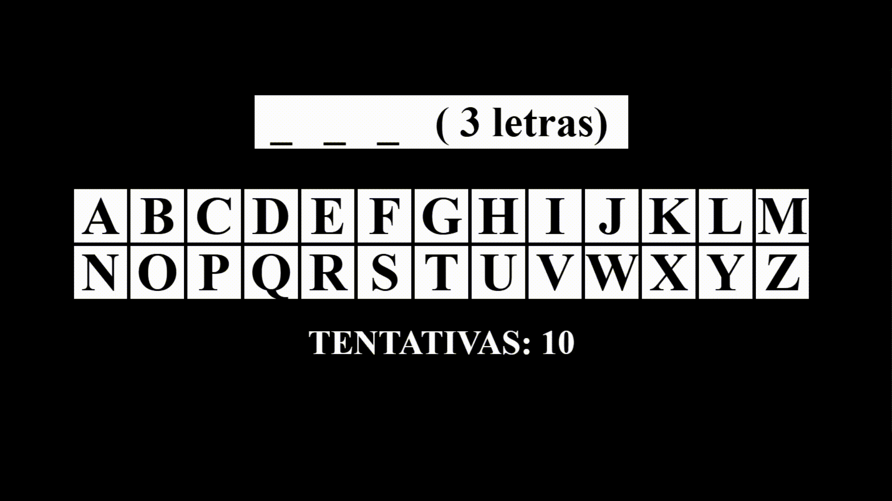

## 🎮 JSGAME Jogo da Forca

  

Bem-vindo ao **JSGame Jogo da Forca**! Neste repositório, você encontrará um jogo simples e divertido para jogar com seus amigos, inspirado no clássico *Jogo da Forca*.

🎲 **[Clique aqui para jogar agora](https://ismaelldiias.github.io/jsgame-jogo-da-forca/)**

---

## 🎯 Objetivo

Acertar a palavra antes que o número de tentativas se esgote.

---

## 🛠️ Tecnologias Utilizadas

- **HTML5** e **CSS3** – Estrutura e aparência do jogo  
- **JavaScript** – Lógica do jogo e interatividade

---

## 🚀 Como Jogar

1. Clone este repositório para sua máquina local.
2. Abra o arquivo `index.html` em seu navegador web.
3. Individualmente ou em grupo, cada pessoa deve, em sua vez, escolher uma **letra** e clicar nela para verificar se a palavra a contém:
   - Se a letra **não estiver** na palavra, a vez passa para a próxima pessoa e uma tentativa é consumida.
   - Se a letra **estiver** na palavra, a pessoa pode jogar novamente, e a quantidade de tentativas permanece.
   - Se a **palavra for completada**, o jogo encerra com uma mensagem de parabéns!
   - Se as **tentativas se esgotarem**, o jogo encerra e revela qual era a palavra.
4. Para jogar novamente, basta atualizar a página (**F5**).

---

## 🤝 Contribuição

Contribuições são muito bem-vindas! Se você deseja melhorar o jogo, adicionar novos recursos ou corrigir bugs, fique à vontade para abrir um **pull request**.
